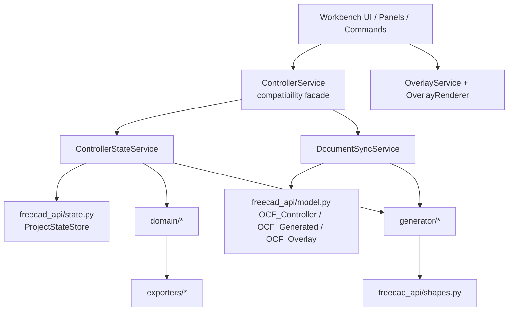
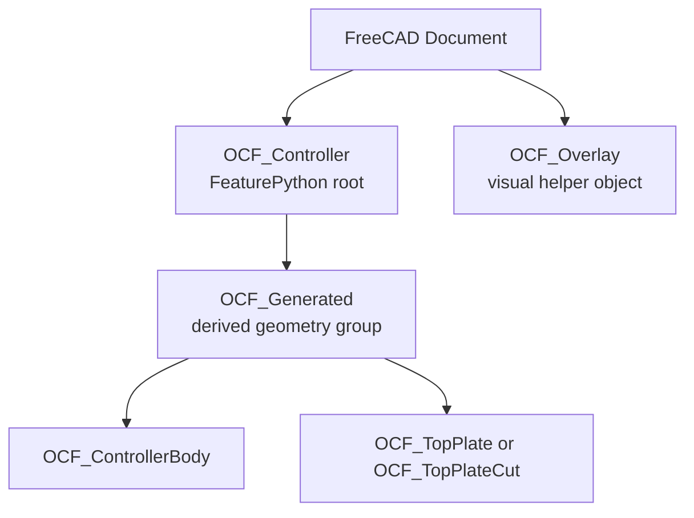
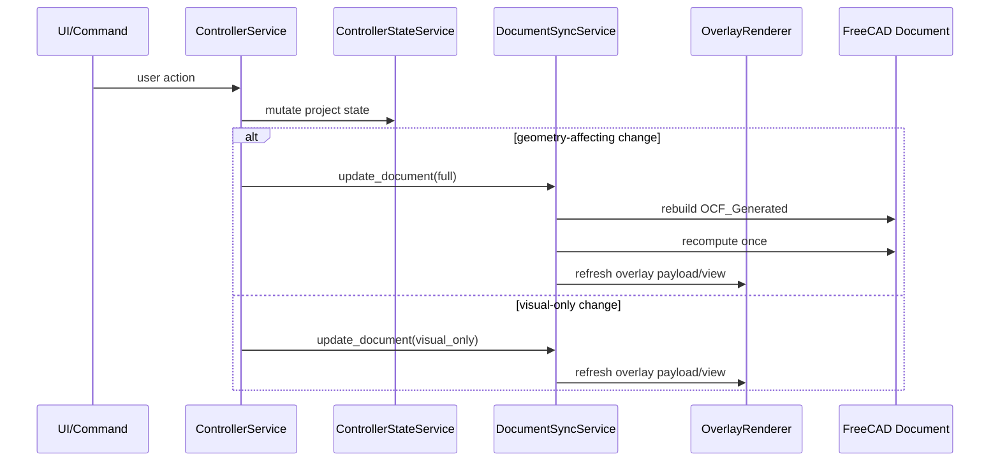

# Open Controller FreeCAD Workbench Architecture

## Purpose

This document defines the target architecture for the Open Controller FreeCAD workbench.
It is intended as the reference for ongoing refactors and should stay aligned with the
real repository state.

The goal is not a full PartDesign rewrite in one step.
The goal is a professional, testable, FreeCAD-native workbench architecture that can
evolve from the current implementation without breaking the existing workflow.

## Scope

This document covers:

- current repository state
- current architectural problems
- target object model and document tree
- target service and module boundaries
- geometry and boolean strategy
- FeaturePython and persistence strategy
- overlay and view-provider strategy
- recompute and sync strategy
- migration path from current state to target state

This document does not prescribe:

- a full PartDesign feature tree today
- a complete drag-and-drop interaction redesign
- a final manufacturing/export architecture beyond the current adapter boundaries

## Current State

The repository has already completed several important refactors:

- `OCF_Controller` exists as the document model root
- `ProjectJson` on `OCF_Controller` is the primary persisted project payload
- `ControllerProxy` mirrors selected scalar properties to FreeCAD properties
- generated geometry is managed via `OCF_Generated`
- overlay is rendered through a dedicated `OCF_Overlay` object and view provider
- `ControllerService` is now a compatibility facade
- state mutation and document sync are split into `ControllerStateService` and `DocumentSyncService`
- explicit sync modes exist: `full`, `visual_only`, `partial_ready`, `state_only`
- geometry planning in `ControllerBuilder` is split into body, top plate, cutout and boolean stages

This is already a better architecture than the original script-like implementation, but
several areas still need a clearer target model.

## Main Architectural Problems

### 1. Legacy and Compatibility Paths Still Exist

The state layer is cleaner, but some compatibility paths still exist for legacy state
loading and facade-based service usage. This is acceptable for now, but it must remain
migration-only and not become the long-term architecture again.

### 2. Geometry Is Still Rebuilt Mostly as an Offline Shape Pipeline

The current geometry pipeline is modularized, but the FreeCAD integration is still
largely "build shapes offline, then assign them to document features". This is correct
for the current stage, but it is not yet a truly parametric FreeCAD object model.

### 3. Sync Strategy Is Explicit but Still Coarse

`full` versus `visual_only` is already a meaningful improvement, but most state changes
that affect geometry still rebuild the full generated set. This is acceptable today, but
the architecture should prepare for later partial updates without rewriting the entire
stack.

### 4. Controller Feature Is the Root, but Not Yet the Full Parametric Master

`OCF_Controller` already behaves as the persisted project root, but `execute()` is not
yet the main parametric geometry driver. This should change gradually, without forcing a
large geometry rewrite now.

### 5. Document Tree Is Cleaner but Still Transitional

The tree is much cleaner than before, but the current structure still mixes:

- model root
- generated geometry container
- visual helper overlay

This is manageable, but the ownership rules must remain strict and explicit.

## Target Architecture

### Design Principles

- document state has exactly one persisted project source of truth
- UI code does not perform geometry work directly
- state mutation is testable without FreeCAD document geometry
- generated geometry is owned and replaceable as a derived layer
- overlay is view-only and never part of manufacturing geometry
- document tree ownership is explicit, not based on naming heuristics
- recompute is intentional, not incidental

## Target Layer Model

### Layer Responsibilities

#### 1. Workbench UI Layer

Modules:

- `workbench.py`
- `gui/panels/*`
- `commands/*`
- `gui/runtime.py`

Responsibilities:

- present the workflow
- collect user input
- route user intent into facade or narrow services
- show status, warning, and error feedback
- request visual-only overlay refreshes when appropriate

Must not:

- write project state directly into document metadata
- build geometry directly
- decide document ownership rules

#### 2. Compatibility Facade

Module:

- `services/controller_service.py`

Responsibilities:

- preserve the current public API for panels, commands, and interaction helpers
- delegate state changes to `ControllerStateService`
- delegate document updates to `DocumentSyncService`

Target state:

- keep this as a stable migration facade
- reduce new direct dependencies on the facade over time
- allow future callers to use narrow services directly

#### 3. State Mutation Layer

Module:

- `services/controller_state_service.py`

Responsibilities:

- create projects from templates and variants
- normalize and persist project state
- mutate controller, component, layout, and validation state
- produce UI context from project state

Must stay:

- FreeCAD-document-light
- deterministic
- unit-testable without shape generation

#### 4. Document Sync Layer

Module:

- `services/document_sync_service.py`

Responsibilities:

- consume normalized project state
- rebuild or refresh derived document objects
- own generated object cleanup
- own recompute strategy
- coordinate selection highlighting and document reveal/focus behavior

Must not:

- mutate business rules that belong to the state layer
- store user preferences

#### 5. Domain and Generator Layer

Modules:

- `domain/*`
- `generator/controller_builder.py`
- `generator/mechanical_resolver.py`
- layout and constraint modules

Responsibilities:

- normalize templates and component definitions
- resolve mechanical cutout/keepout meaning
- plan body, top plate, cutout tools, and booleans
- validate and place components

#### 6. FreeCAD Adapter Layer

Modules:

- `freecad_api/model.py`
- `freecad_api/state.py`
- `freecad_api/shapes.py`

Responsibilities:

- bridge normalized project data into FreeCAD objects and shapes
- keep object creation and document persistence rules explicit
- isolate FreeCAD-specific APIs from most of the application

## Target Project Persistence Model

### Single Source of Truth

The single source of truth for a controller project is:

- document object: `OCF_Controller`
- property: `ProjectJson`

`ProjectJson` stores the normalized project snapshot.

Mirrored scalar properties on `OCF_Controller` exist for:

- inspection
- property editor visibility
- future parametric behavior
- basic FreeCAD-native discoverability

They are not the primary persistence format.

### FeaturePython Role

`OCF_Controller` should remain an `App::FeaturePython` object with a `ControllerProxy`.

Target responsibilities of `ControllerProxy`:

- ensure required properties exist
- keep mirrored scalar properties synchronized with `ProjectJson`
- recover proxy/view-provider wiring on restore
- later act as the anchor for parametric update routing

### Restore Strategy

`onDocumentRestored()` must:

- restore proxy identity
- restore or reattach view provider
- restore property synchronization from `ProjectJson`
- avoid performing heavy geometry rebuild work directly

Heavy rebuild work should remain in explicit sync/update calls rather than hidden inside
restore hooks.

## Target Document Object Model

### Target Tree

### Ownership Rules

`OCF_Controller`

- persisted project root
- owns project identity and mirrored controller properties
- claims `OCF_Generated` in the tree

`OCF_Generated`

- contains only generated model geometry
- is fully replaceable from project state
- is the only normal cleanup target for generated objects

`OCF_Overlay`

- separate visual helper object
- not manufacturing geometry
- not part of the generated geometry cleanup group
- updated independently from normal geometry rebuild where possible

### What Must Not Happen Again

- global cleanup over arbitrary `doc.Objects` with `OCF_*` name heuristics
- overlay items as hundreds of `Part::Feature` document objects
- keepout helper markers materialized by default as document objects
- state spread across multiple actively written document metadata formats

## Target Geometry Strategy

### Near-Term Strategy

Keep the current staged geometry pipeline, because it is already a strong intermediate
step and supports testability:

1. surface resolution
2. body build planning
3. top plate build planning
4. cutout primitive collection
5. boolean planning and diagnostics
6. final shape assignment to generated objects

### Boolean Strategy

Target rule:

- cutout tool shapes are built in memory
- diagnostic planning happens before the final cut
- a composite tool is used where possible
- the document receives only the final top plate result

### Parametric Evolution Strategy

Do not force a full PartDesign body/feature chain immediately.

Instead:

- keep `ControllerBuilder` as the geometry planning layer
- keep `DocumentSyncService` as the explicit assignment layer
- later move toward finer-grained parametric updates where the project root can request:
  - controller shell update
  - top plate update
  - cutout update

This keeps migration risk lower than a full rewrite.

## Target Overlay and ViewProvider Strategy

### Overlay Principles

- overlay is visual-only
- overlay is not part of the manufacturing model
- overlay updates should not require a full model rebuild
- overlay items must never create one document object per helper primitive

### Target Overlay Path

- one `OCF_Overlay` `FeaturePython` object
- one dedicated overlay view provider
- Coin scene graph rendering for:
  - outlines
  - keepouts
  - cutout previews
  - constraint lines
  - measurement guides
  - labels

### Label Strategy

Text labels should be rendered as text in the overlay view provider.
If text is unavailable in a given runtime, the fallback should be omission or a clean
non-geometric placeholder policy, not fake cylinders or unrelated solids.

## Target Recompute and Sync Model

### Sync Modes

The current explicit sync modes are the correct basis and should remain:

- `full`
- `visual_only`
- `partial_ready`
- `state_only`

### Target Meaning of Each Mode

`full`

- consume current project state
- rebuild derived model geometry
- update generated group contents
- run one bounded document recompute
- refresh overlay if needed after geometry is valid

`visual_only`

- no geometry rebuild
- no full document recompute
- selection highlight and overlay refresh only

`partial_ready`

- reserved for future scoped geometry updates
- examples:
  - controller shell only
  - top plate only
  - cutout set only
  - selection-derived visuals only

`state_only`

- for headless or no-object environments
- update state and metadata only

### Target Sync Flow

### Recompute Rule

`doc.recompute()` should be owned by the document sync layer and not be triggered from:

- overlay rendering
- panel field synchronization
- status updates
- per-item visual loops

The default expectation is:

- one bounded recompute per full document update
- zero recomputes for overlay-only updates

## Target UI-to-Core Boundary

### Panels and Commands

Panels and commands should call:

- facade methods for compatibility today
- narrow services directly only when the dependency is truly local and stable

Panels should not:

- inspect `doc.Objects` to infer state
- perform object cleanup
- decide which generated object names are canonical

### Status and Error Feedback

User-facing status feedback should remain centralized at the workbench shell level where
possible.

Panels may still show local contextual hints, but:

- success/warning/error summaries should be phrased in user terms
- raw FreeCAD or OCC exceptions should be normalized before user display
- console logging should remain available for diagnostics, not as the main UX channel

## Target Module Boundaries

The following module roles should remain stable:

### Stable Modules

- `freecad_api/state.py`
- `freecad_api/model.py`
- `services/controller_state_service.py`
- `services/document_sync_service.py`
- `generator/controller_builder.py`
- `services/overlay_service.py`
- `gui/overlay/renderer.py`

### Transitional Modules

- `services/controller_service.py`
- selected command classes that still route everything through the facade

These modules may remain as adapters during migration, but should not accumulate new
core business logic.

## Migration Path

### Phase 1: Completed / Mostly Completed

- establish `OCF_Controller` as project root
- establish `ProjectJson` as single persisted project payload
- split state mutation from document sync
- move generated object ownership to `OCF_Generated`
- move overlay to one dedicated object
- introduce explicit sync modes
- modularize geometry planning

### Phase 2: Stabilize the Master Feature

- keep improving `ControllerProxy.execute()` and restore behavior
- formalize mirrored property rules
- ensure object and tree ownership remain explicit
- avoid hidden rebuild side effects in property hooks

### Phase 3: Scoped Document Updates

- define which state mutations affect which derived geometry slices
- allow `partial_ready` to evolve into real partial sync modes
- keep the public workflow stable while reducing rebuild cost

### Phase 4: More Parametric FreeCAD-Native Geometry

- optionally promote selected generated geometry into more parametric sub-features
- evaluate whether controller shell and top plate should become more persistent derived
  features rather than always replaced shapes
- keep boolean planning and diagnostics reusable regardless of feature strategy

### Migration Constraints

- preserve existing templates and variants
- preserve current testability of non-FreeCAD-heavy logic
- avoid large UI rewrites during core architecture steps
- prefer compatibility adapters over broad API breaks

## Risks

### 1. Hidden FreeCAD Coupling

Even after service splitting, it is easy for GUI or sync code to reintroduce direct
document inspection or recompute logic in the wrong layer.

Mitigation:

- keep document ownership helpers centralized
- keep tests around sync mode behavior

### 2. Property Sync Side Effects

More FreeCAD-native property behavior can accidentally trigger recursive updates or
implicit rebuilds.

Mitigation:

- keep explicit recursion guards in proxies
- keep state write rules centralized

### 3. Partial Update Complexity

Real partial geometry updates can become more complex than a full rebuild if ownership
and dependency boundaries are unclear.

Mitigation:

- do not enable true partial geometry updates until dependency slices are explicit

### 4. Overlay Drift

If overlay geometry or labels are generated by separate logic from real cutout/keepout
resolution, mismatch risk grows.

Mitigation:

- keep overlay inputs derived from the same normalized primitives and diagnostics

## Non-Goals

The following are explicitly not required for the target architecture in the near term:

- a full migration to PartDesign feature trees
- a complete solver-based layout system
- a full 3D direct-manipulation workflow
- elimination of every compatibility adapter immediately
- storing user preferences inside project state

## Decision Summary

The intended end state is:

- `OCF_Controller` as the authoritative persisted project root
- `ProjectJson` as the single project payload
- `OCF_Generated` as the only standard container for derived model geometry
- `OCF_Overlay` as a separate visual helper object
- `ControllerStateService` for mutation
- `DocumentSyncService` for rebuild
- explicit sync modes with recompute ownership in one layer
- staged geometry planning before feature assignment

This architecture is compatible with the current repository and provides a realistic path
toward a more professional FreeCAD workbench without a risky total rewrite.
